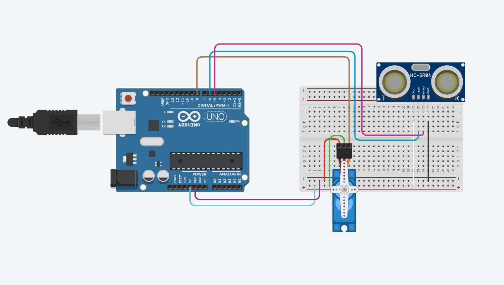

<h1  align=center>Bin with Servo Motor and HC-SR04 Ultasonic Sensor</h1>  

<small>Picture Source:<a  href="https://www.cuidevices.com/products/image/getimage/93236?typecode=m"> cuidevices</a>

 

<h2>Statement</h2>

The aim of this project is to develop a prototype that opens the trash can lid contactlessly using various tools. Detailed explanations are explained in order. The program was simulated through the Tinkercad program and then applied in practice. 

 

<h2>Materials</h2>
<ul>
 <li>1 Arduino UNO</li>
<li>1 USB 2.0 to USB B Cable</li>
<li>4 Male to Female Jumper Cable</li>
<li>4 Female to Female Jumper Cable (Optional, depends on distance between Arduino to bin!)</li>
<li>1 Servomotor</li>
<li>1 HC-SR06 Distance Sensor</li>
<li>1 Bin</li>
<li>1 Stick or piece of wood (for Servomotor)</li>
</ul>

 

<h2>Building Prototype</h2>

The following simulation was created via Tinkercad.

     

After the model is created, there is the coding part next.

Pin numbers and libraries are specified:

    #include <Servo.h>

	Servo motor; 

	#define echo 5
	#define trig 6

	void setup() {
	
	  pinMode(trig, OUTPUT);
	  pinMode(echo, INPUT);
	  motor.attach(8); 
	  Serial.begin(9600);
	  
	}

Within a quarter of a second, the ultrasonic sensor scanned whether there was any object close to the sensor. This sensor reads from <i>2cm to 400cm (0.8inch to 157inch)</i> with an accuracy of <i>0.3cm (0.1inches)</i>, which is good for most hobbyist projects. The distance (in cm) was calculated according to the sound velocity and the distance was calculated over the time variable.

    digitalWrite(trig, LOW);
	delayMicroseconds(2);
	digitalWrite(trig, HIGH);
	delayMicroseconds(2);
	digitalWrite(trig, LOW);
	  
	float time = pulseIn(echo, HIGH);
	float cm = time/58.2;
	delay(250);

	
If the object brought closer to the ultrasonic sensor is closer than <i>10 centimeters</i>, the motor will move at an angle of <i>90 degrees</i>. Then it will wait for <i>5</i> seconds and the servo motor will return to its original state.

      if (cm < 10){
        motor.write(90);
        delay(5000);
        motor.write(0);
      }

     

 

<h1>Contact Me</h1>

If you have something to say to me please contact me:

<ul>
  <li>Twitter: <a href="https://twitter.com/Doguilmak">Doguilmak</a></li>
  <li>Mail address: doguilmak@gmail.com</li>
</ul>
 
